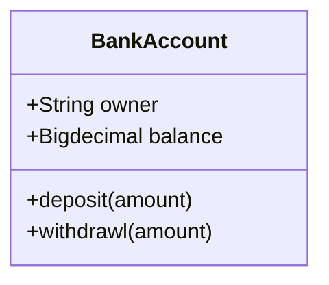
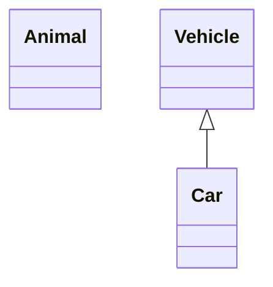
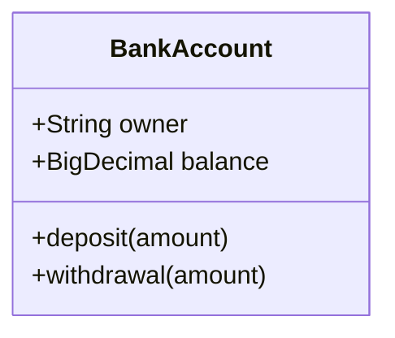
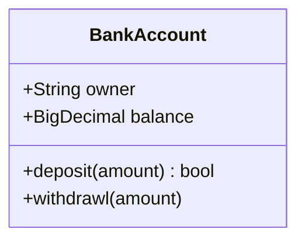
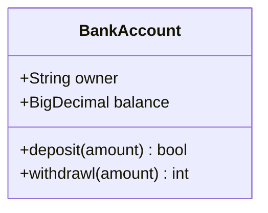
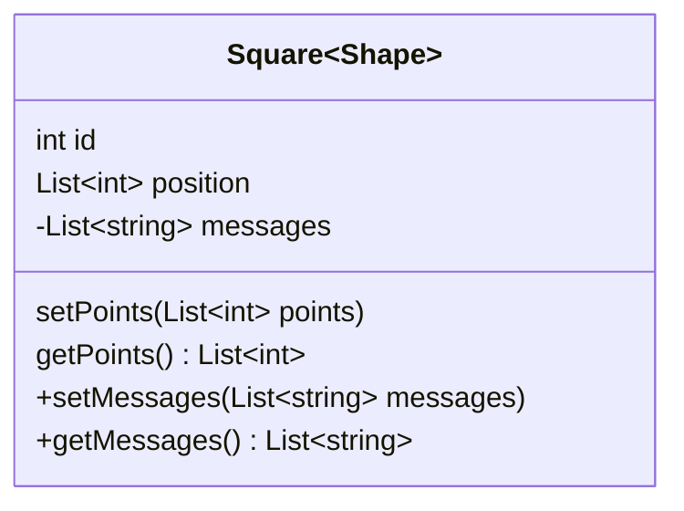
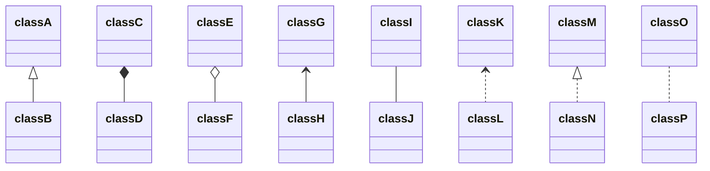

# UML类图
[知乎上关于markdown画图回答](https://zhuanlan.zhihu.com/p/172635547) 

其本身依靠的是`mermaid`脚本语言 [`mermaid`官方wiki](https://mermaid-js.github.io/mermaid/#/)

[mermaid类图画法](https://mermaid-js.github.io/mermaid/#/classDiagram)

`markdown`画图示例如下
源码请参考本项目github`右上角那只猫`
## Class


## 定义类



## 类的成员

方式一


方式2


## 返回类型



## 泛型类型




> 注意：通过在方法末尾添加以下符号，也可以在方法定义中包含其他分类器，即：在（）之后：

> - `*` Abstract e.g.: `someAbstractMethod()*`
> - `$` Static e.g.: `someStaticMethod()$`


## 定义类的关系

关系是一个通用术语，涵盖在类和对象图上发现的特定类型的逻辑连接。

```
[classA][Arrow][ClassB]:LabelText
```


``` 
+ public
- private
# protected
~ Package/Internal
Note 注释
Class 类 
Interface 接口 
Dependency 依赖 ---〉
Association 关联 一
Generalization (泛化)继承 一△
Realization 实现 ---△
Aggregation 聚合 一◇
Composite 组合 一◆

表示1对1或1对n关系
1●--〉n
耦合度强弱
虚线比实线弱
空心比实心弱
方块比三角弱
```

## 符号表示

| Type  | Description   |
| ----- | ------------- |
| <\|-- | Inheritance   |
| *--   | Composition   |
| o--   | Aggregation   |
| -->   | Association   |
| --    | Link (Solid)  |
| ..>   | Dependency    |
| ..\|> | Realization   |
| ..    | Link (Dashed) |



## 类之间关系
### 依赖关系 Dependency
Persion`---〉`Phone
依赖（Dependency）关系是一种使用关系，它是对象之间耦合度最弱的一种关联方式，是临时性的关联。在代码中，某个类的方法通过局部变量、方法的参数或者对静态方法的调用来访问另一个类（被依赖类）中的某些方法来完成一些职责。
耦合度最弱,临时性关联
```java
public class Persion {
	private String name;
	public void call(Phone p){
		p.transfer();
	}
}
public class Phone{
	public void transfer(){}
}
```

### 关联关系 Association
Teacher`一`Student
关联（Association）关系是对象之间的一种引用关系，用于表示一类对象与另一类对象之间的联系，如老师和学生、师傅和徒弟、丈夫和妻子等。关联关系是类与类之间最常用的一种关系，分为一般关联关系、聚合关系和组合关系。我们先介绍一般关联。
一个对象作为另一个类的成员变量
```java
public class Teacher {
	private String name;
	private List<Student> stus;
	public void teaching(){}
}
public class Student {
	private Sting name;
	private List<Teacher> teas;
	public void study(){}
}
```

### 聚合关系 Aggregation
Teacher`一◇`University
聚合（Aggregation）关系是关联关系的一种，是强关联关系，是整体和部分之间的关系，是 has-a 的关系。
成员对象是整体的一部分,可以脱离整体存在
```java
public class University {
	private List<Teacher> teas;
}
public class Teacher {
	private String name;
	public void teaching(){}
}
```

### 组合关系 Composition
Mouth`一◆`Head
组合（Composition）关系也是关联关系的一种，也表示类之间的整体与部分的关系，但它是一种更强烈的聚合关系，是 cxmtains-a 关系。
整体对象可以控制部分对象的生命周期,整体不存在,部分也将不存在
```java
public class Head {
	private Mouth mouth;
}
public class Mouth {
	public void eat(){}
}
```

### 泛化关系 Generalization
Student`一△`Persion
泛化（Generalization）关系是对象之间耦合度最大的一种关系，表示一般与特殊的关系，是父类与子类之间的关系，是一种继承关系，是 is-a 的关系。
```java
public class Persion {
	private String name;
	private int age;
	public void speak(){}
}
public class Student extend Persion {
	private long studentNo;
	public void study(){}
}
public class Teacher extend Persion {
	private long teacherNo;
	public void teaching(){}
}
```

### 实现关系 Realization
Car`---△`Vehicle
实现（Realization）关系是接口与实现类之间的关系。在这种关系中，类实现了接口，类中的操作实现了接口中所声明的所有的抽象操作。

```java
public interface Vehicle {
	void move();
}
public class Car implements Vehicle {
	public void move(){}
}
public class Ship implements Vehicle {
	public void move(){}
}
```


