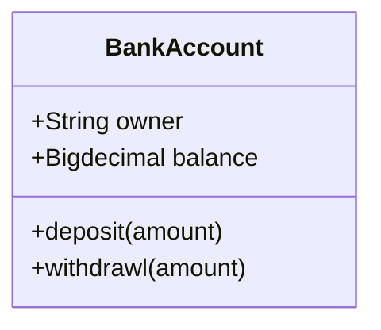
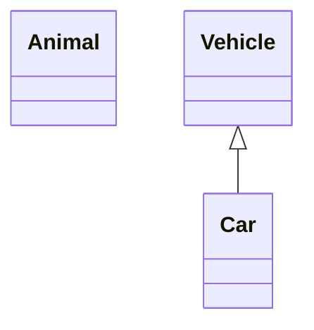
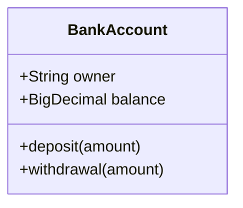
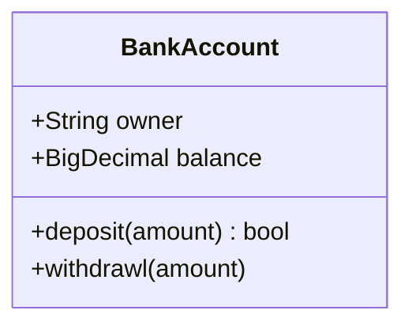
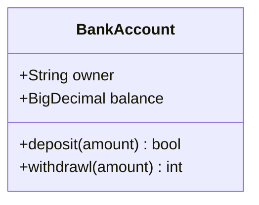
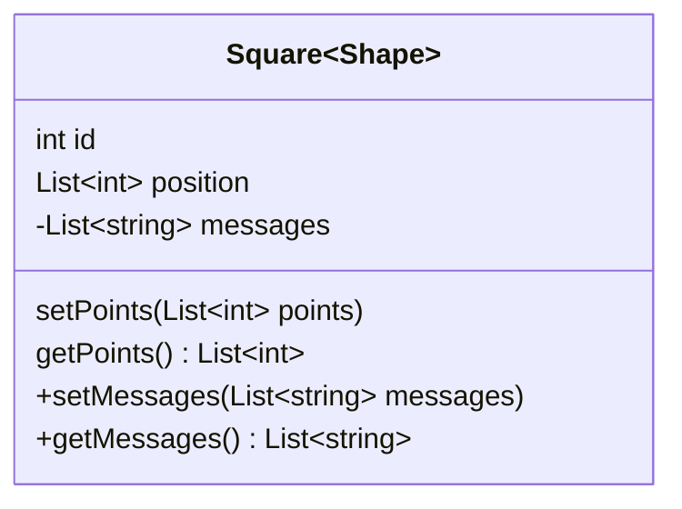
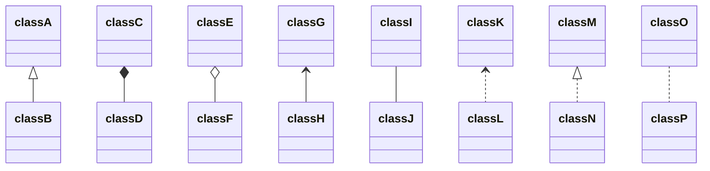

# UML类图
[知乎上关于markdown画图回答](https://zhuanlan.zhihu.com/p/172635547) 

其本身依靠的是`mermaid`脚本语言 [`mermaid`官方wiki](https://mermaid-js.github.io/mermaid/#/)

[mermaid类图画法](https://mermaid-js.github.io/mermaid/#/classDiagram)

`markdown`画图示例如下
源码请参考本项目github`右上角那只猫`
## Class


## 定义类



## 类的成员

方式一


方式2


## 返回类型



## 泛型类型




> 注意：通过在方法末尾添加以下符号，也可以在方法定义中包含其他分类器，即：在（）之后：

> - `*` Abstract e.g.: `someAbstractMethod()*`
> - `$` Static e.g.: `someStaticMethod()$`


## 定义类的关系

关系是一个通用术语，涵盖在类和对象图上发现的特定类型的逻辑连接。

```
[classA][Arrow][ClassB]:LabelText
```


``` 
+ public
- private
# protected
~ Package/Internal
Note 注释
Class 类 
Interface 接口 
Dependency 依赖 ---〉
Association 关联 一
Generalization (泛化)继承 一△
Realization 实现 ---△
Aggregation 聚合 一◇
Composite 组合 一◆

表示1对1或1对n关系
1●--〉n
```

## 符号表示

| Type  | Description   |
| ----- | ------------- |
| <\|-- | Inheritance   |
| *--   | Composition   |
| o--   | Aggregation   |
| -->   | Association   |
| --    | Link (Solid)  |
| ..>   | Dependency    |
| ..\|> | Realization   |
| ..    | Link (Dashed) |



